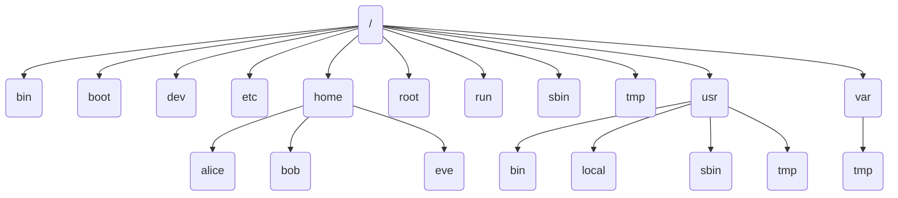

# 学习目标  
- 描述分件系统重要的组成部分
- 复制，移动和删除文件
- 创建文件和文件夹
- 了解时间戳的概念

# Linux 文件系统的组成  
整个文件系统由 分区--目录 对接  
文件都是从根开始的，无论文件在哪个分区，都可以通过根访问到  

- 文件和目录构成单根的倒树状结构
- 文件系统从根目录开始，表示为一个单独的’/’(斜线)字符
- 命名大小写敏感
- 路径以’/’为分隔

<!-- more -->  

**执行命令：ls -la；显示白色是文件，蓝色是目录**  

| d    | r-xr-x---. | 15 | root | root  | 4096   | Jul  3 04:43  | .  |
| ---- | -- | --- | --- | ------ | ---- | ----- | ------ |
| 文件 | 权限 | 文件:链接数/目录:子目录数 | 拥有人 | 拥有组 | 文件大小（默认字节） | 最后一次修改时间 | 文件名 |

# 基本目录  
1. **/：根目录**，位于 Linux 文件系统目录结构的顶层，一般根目录下只存放目录，不要存放文件，/etc、/bin、/dev、/lib、/sbin 应该和根目录放置在一个分区中。 
2. **/bin，/usr/bin：这两个目录为命令文件目录**，也称为二进制目录。包含了供系统管理员及普通用户使用的重要的 linux 命令和二进制（可执行）文件，包含 shell 解释器等。在 linux 7 或者更高的版本中，/bin 和/usr/bin，/sbin 和/usr/sbin，/lib 和/usr/lib、lib64 和/usr/lib64 中，/中的目录是/usr/中对应目录软链接。相当于 win 的快捷方式 访问/bin 和/usr/bin 是一样的
3. **/boot： 该目录中存放系统的内核文件和引导装载程序文件**，/boot/vmlinuz 为 linux 的内核文件，以及/boot/gurb。一般情况下都是单独分区，分区大小 200M 即可。
4. **/dev： 设备（device）文件目录**，存放 linux 系统下的设备文件，访问该目录下某个文件，相当于访问某个设备，存放连接到计算机上的设备（终端、磁盘驱动器、光驱及网卡等）的对应文件，包括字符设备和块设备等，常用的是挂载光驱： **mount /dev/cdrom  /mnt。** 
5. **/etc： 系统配置文件存放的目录**，该目录存放系统的大部分配置文件和子目录，不建议在此目录下存放可执行文件，重要的配置文件有/etc/inittab、/etc/fstab、/etc/init.d、/etc/X11（X Window 系统有关）、/etc/sysconfig（与网络有关）、/etc/xinetd.d 等等，修改配置文件之前记得备份。该目录下的文件由系统管理员来使用，普通用户对大部分文件有只读权限。
6. **/home： 系统默认的用户宿主目录**，新增用户账号时，用户的宿主目录都存放在此目录下，表示当前用户的宿主目录，test 表示用户 test 的宿主目录。如果做文件服务器，建议单独分区，并设置较大的磁盘空间，方便用户存放数据。用户传上来的数据和其他系统文件隔离，安全性高些！
7. **/lib，/usr/lib，/usr/local/lib：系统使用的函数库的目录**，程序在执行过程中，需要调用一些额外的参数时需要函数库的协助，该目录下存放了各种编程语言库。典型的 linux 系统包含了 C、C++和 FORTRAN 语言的库文件。/lib 目录下的库映像文件可以用来启动系统并执行一些命令，目录/lib/modules 包含了可加载的内核模块，/lib 目录存放了所有重要的库文件，其他的库文件则大部分存放在/usr/lib 目录下。
8. **/mnt，/media： mnt 目录主要用来临时挂载文件系统，为某些设备提供默认挂载点，如 cdrom**。这样当挂载了一个设备如光驱时，就可以通过访问目录/mnt 下的文件来访问相应的光驱上的文件了。
9. **/opt： 给主机额外安装软件所摆放的目录**。如果想要自行安装新的 KDE 桌面软件，可以将该软件安装在该目录下。以前的 Linux 系统中，习惯放置在 /usr/local 目录下。
10. **/proc： 此目录的数据都在内存中**，如系统核心，外部设备，网络状态，由于数据都存放于内存中，所以不占用磁盘空间，比较重要的目录有/proc/cpuinfo、/proc/interrupts、/proc/dma、/proc/ioports、/proc/net/\*等。
11. **/root：系统管理员 root 的宿主目录**，系统第一个启动的分区为/，所以最好将/root 和/放置在一个分区下。
12. **/sbin，/usr/sbin，/usr/local/sbin：放置系统管理员使用的可执行命令**，如 fdisk、shutdown、mount 等。与/bin 不同的是，这几个目录是给系统管理员 root 使用的命令，一般用户只能"查看"而不能设置和使用。
13. **/tmp： 一般用户或正在执行的程序临时存放文件的目录**,任何人都可以访问,重要数据不可放置在此目录下。
14. **/srv： 服务启动之后需要访问的数据目录**，如 www 服务需要访问的网页数据存放在/srv/www 内。
15. **/usr： 应用程序存放目录**，/usr/bin 存放应用程序， /usr/share 存放共享数据，/usr/lib 存放不能直接运行的，却是许多程序运行所必需的一些函数库文件，/usr/local 存放软件升级包，/usr/share/doc 系统说明文件存放目录。
16. **/usr/share/man:程序说明文件存放目录**，使用 man ls 时会查询/usr/share/man/man1/ls.1.gz 的内容，建议单独分区，设置较大的磁盘空间。
17. **/var： 放置系统执行过程中经常变化的文件，如随时更改的日志文件** /var/log。/var/log/message： 所有的登录文件存放目录。/var/spool/mail： 邮件存放的目录。建议单独分区，设置较大的磁盘空间。
18. **/run**：目录中存放的是自系统启动以来描述系统信息的文件
19. **/sys**： 挂载点上挂载 sysfs 虚拟文件系统，我们可以通过 sysfs 文件系统访问 Linux 内核

# 重要目录  
**/etc：这个目录相当重要**，如前所述，你的开机与系统数据文件均在这个目录之下，因此当这个目录被破坏，那你的系统大概也就差不多该死掉了！而在往后的文件中，你会发现我们常常使用这个目录下的 /etc/rc.d/init.d 这个子目录，因为这个 init.d 子目录是开启一些 Linux 系统服务的 scripts 的地方。而在 /etc/rc.d/rc.local 这个文件是开机的执行档。  
**/bin, /sbin, /usr/bin, /usr/sbin：这是系统预设的执行文件的放置目录**，例如 root 常常使用的 userconf, netconf, perl, gcc, c++ 等等的数据都放在这几个目录中，所以如果你在提示字符下找不到某个执行档时，可以在这四个目录中查一查！其中， /bin, /usr/bin 是给系统使用者使用的指令，而 /sbin, /usr/sbin 则是给系统管理员使用的指令！   
**/usr/local：这是系统预设的让你安装你后来升级的套件的目录**。例如，当你发现有更新的 Web 套件（如 Apache ）可以安装，而你又不想以 rpm 的方式升级你的套件，则你可以将 apache 这个套件安装在 /usr/local 底下。安装在这里有个好处，因为目前大家的系统都是差不多的，所以如果你的系统要让别人接管的话，也比较容易上手！也比较容易找的到数据！因此，如果你有需要的话，通常都会将 /usr/local/bin 这个路径加到 path 中。  
**/home：这个是系统将有账号的人口的家目录设置的地方。** 　  
**/var：这个路径就重要了！不论是登入、各类服务的问题发生时的记录、以及常态性的服务记录等等的记录目录**，所以当你的系统有问题时，就需要来这个目录记录的文件数据中察看问题的所在！而 mail 的预设放置也是在这里，所以他是很重要的 。   
**/usr/share/man, /usr/local/man： 这两个目录为放置各类套件说明档的地方**，例如你如果执行 man man，则系统会自动去找这两个目录下的所有说明文件。  

# 一些常用文件目录  
**用户账号文件：/etc/passwd**

|字段 1|字段 2|字段 3|字段 4|字段 5|字段 6|字段 7|
|---|---|---|---|---|---|---|
|user01|x:|1000:|1000:|User One:|/home/user01|/bin/bash|
|用户名称|密码占位符“x”(表示登录该用户时需要密码，红帽 8 去掉也需要密码）|用户帐号的 UID 号| 用户的私有组|用户描述信息|用户的主目录|登录 Shell 信息|

**密码文件：/etc/shadow**

| 字段 1 | 字段 2 | 字段 3 | 字段 4 | 字段 5 | 字段 6 | 字段 7 | 字段 8 | 字段 9 |
| ----- | ----- | ----- | ----- | ----- | ----- | ----- | ----- | ----- |
|user03|\$6\$CSsx...output omitted...:|17933|0|99999:|7|2|18113||
|用户帐号的名称|加密的密码字串信息|最近一次修改密码的时间，表示从 1970.01.01 至今的天数|密码的最短使用天数，默认值为 0，没有要求|密码的最长有效天数，默认值为 99999|密码即将到期警告天数，默认值为 7|在密码过期之后账号保持活动的天数，指定天数后账号被锁定，成为无效|帐号失效时间，默认值为空，以 1970.01.01 的天数表示|保留字段（未使用）|

**组信息文件：/etc/group**

| 字段 1 | 字段 2 | 字段 3 | 字段 4 |
| ----- | ----- |
|组的名称|密码占位符“x”|组的 ID 号|该组是 user1，user2 和 user3 的附加组|

#文件和目录名  
**名字不能多于 255 个字符**
**所有字符都要求是有效的，除斜线(/)之外**
不要使用某些特殊的字符在文件或者目录名中
当文件名中有特殊字符时应用引号保护引起来
**命名和大小写敏感**
例如:MAIL,Mail,mail 和 mAiL

# 绝对路径和相对路径  
**绝对路径：**  
以根开头的路径  
文件位置的全路径  
在任何位置都可以引用  
**相对路径：**  
不以斜线开头  
当前工作目录的相对位置  
在特定的位置才可以引用

# 管理文件和目录的基本命令  
**ls**：显示当前目录或者指定目录下的内容  
使用  
ls [options] [files or dirs]
示例  
ls -a (包括隐藏文件)  
ls -l (显示扩展信息)  
ls -R(递归所有的目录)  
ls -ld (显示目录和符号链接信息)

**mkdir**：
1. 命令格式  
mkdir [-选项] 目录...
2. 命令功能  
通过 mkdir 命令可以实现在指定位置创建指定的文件名的文件夹。**要创建文件夹的用户必须对所创建的文件夹的父文件夹具有写权限**。并且，所创建的文件夹不能与其父目录中的已经存在文件重名，即同一个目录下不能有同名的(区分大小写)。 
3. 命令参数  
 -p, --parents 可以是一个路径名称。**此时若路径中的某些目录尚不存在,加上此选项后,系统将自动建立好那些尚不存在的目录**,即一次可以建立多个目录;   
-v, --verbose 每次创建新目录都显示信息

**pwd**：显示当前所在的目录的绝对路径

**cd**：改变目录  
改变到一个绝对或者相对路径  
cd /home/joshua/work；cd project/docs
改变到上层目录  
cd ..  
改变目录到上一个工作目录  
cd -  
改变到当前用户的主目录  
cd 或者 cd ~  
改变到某个用户的主目录  
cd  ~username

**rmdir**：删除空目录

**cp**：命令主要用于复制文件或目录  
 cp [options] source... directory  
 l -p：除复制文件的内容外，还把修改时间和访问权限也复制到新文件中。  
 l -r：若给出的源文件是一个目录文件，此时将复制该目录下所有的子目录和文件。

**mv**:命令用来为文件或目录改名、或将文件或目录移入其它位置。  
 mv source... directory

**rm**：命令用于删除一个文件或者目录。  
 rm [options] name...  
 l -f 即使文件属性设为只读，也直接删除，无需逐一确认。  
 l -r 将目录及以下之文件一起删除。  
 rm -rf * 删除当前目录下的所有文件及目录

**touch**：命令用于修改文件或者目录的时间属性。若文件不存在，系统会建立一个新的文件。  
命令格式：touch  文件名

**cat**：命令用显示文件内容。

**命令格式**：cat [-选项] 文件  
加参数：-n 或 --number：由 1 开始对所有输出的行数编号。

**more**：命令类似 cat ，不过会以一页一页的形式显示，更方便使用者逐页阅读，而最基本的指令就是按空白键（space）就往下一页显示，按 b 键就会往回（back）一页显示  
l Enter 向下 n 行，需要定义。默认为 1 行  
l 空格键 向下滚动一屏  
l q 退出 more

**less**：工具也是对文件或其它输出进行分页显示的工具，应该说是 linux 正统查看文件内容的工具，功能极其强大。  
1. 命令格式
less [-选项] 文件 
2. 命令功能
less 与 more 类似，但使用 less 可以随意浏览文件，而 more 仅能向前移动，却不能向后移动，而且 less 在查看之前不会加载整个文件。  
/字符串：向下搜索“字符串”的功能  
?字符串：向上搜索“字符串”的功能  
n：重复前一个搜索（与 / 或 ? 有关），next  
N：反向重复前一个搜索（与 / 或 ? 有关）  
Q 退出 less 命令  
Enter 向下 n 行，需要定义。默认为 1 行  
空格键 向下滚动一屏  
b 键 向上滚动一屏  
[pagedown]： 向下翻动一行  
[pageup]：  向上翻动一行  

**head**：用来显示档案的开头至标准输出中。如果指定了多于一个文件，在每一段输出前会给出文件名作为文件头。  
head -n 5 log.txt ；说明：显示文件的前 n 行

**tail**：命令用途是依照要求将指定的文件的最后部分输出  
1. tail filename
说明：显示 filename 最后 10 行。
2. tail -F filename
说明：动态监视 filename 文件的尾部内容（默认 10 行，相当于增加参数 -n 10），刷新显示在屏幕上。退出，按下 CTRL+C。
3. tail -n 20 filename
说明：显示 filename 最后 20 行。

**file 查看文件类型**：查看文件类型  
文件可以包含许多类型的数据  
在文件打开之前先检查文件类型，然后再确定使用适当的命令或者应用程序  
file [options] <filename>……

**tree**：可以查看当前目录下的所有子目录和文件结构

# 单元小结  
- Linux 文件系统层次结构
- 命令行文件管理工具
- 时间戳
