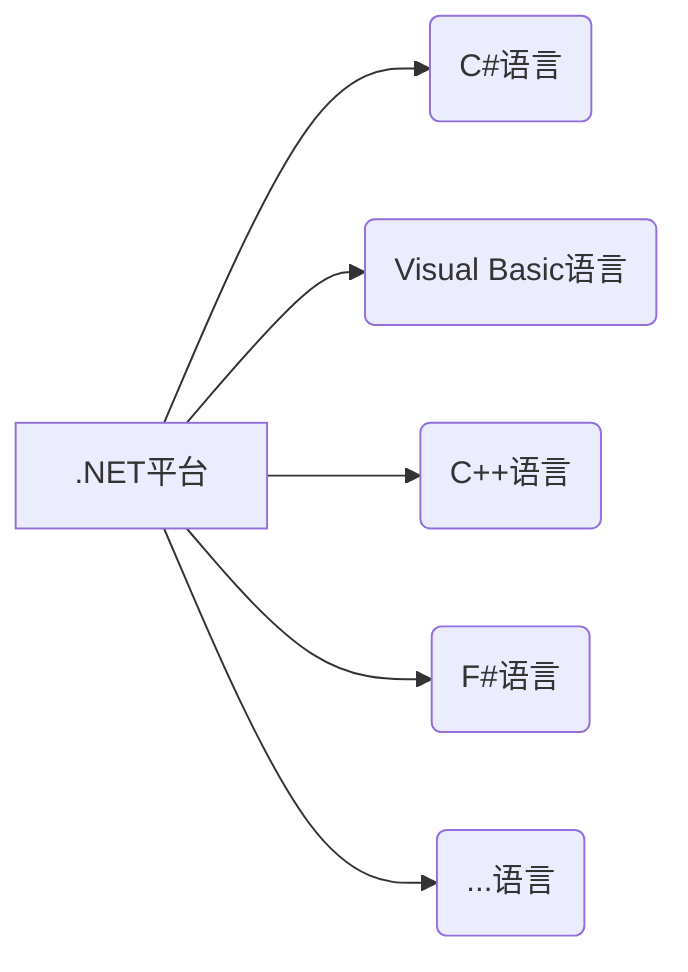

# C#语言及特点
* C#是微软公司发布的一种**面向对象**的、运行于.NET Framework 和 .NET Core (完全开源，跨平台)之上的高级程序设计语言。
* C#是一种**安全的、稳定的、简单的、优雅的**，由 C 和 C++衍生出来的面向对象的编程语言。它在继承 C 和 C++的强大功能的同时去掉了一些它们的复杂特性。
* C#是**面向对象**的编程语言
<!-- more -->  

# 认识 .NET Framework / .NET Core

# Visual Studio 安装使用
https://visualstudio.microsoft.com/zh-hans/downloads/

# 创建第一个程序
Windows 窗体应用（.net framwork）
```C#
namespace WindowsFormsApp1
{
    public partial class Form1 : Form
    {
        public Form1()
        {
            InitializeComponent();
        }

        private void Label1_Click(object sender, EventArgs e)
        {

        }
    }
}
```