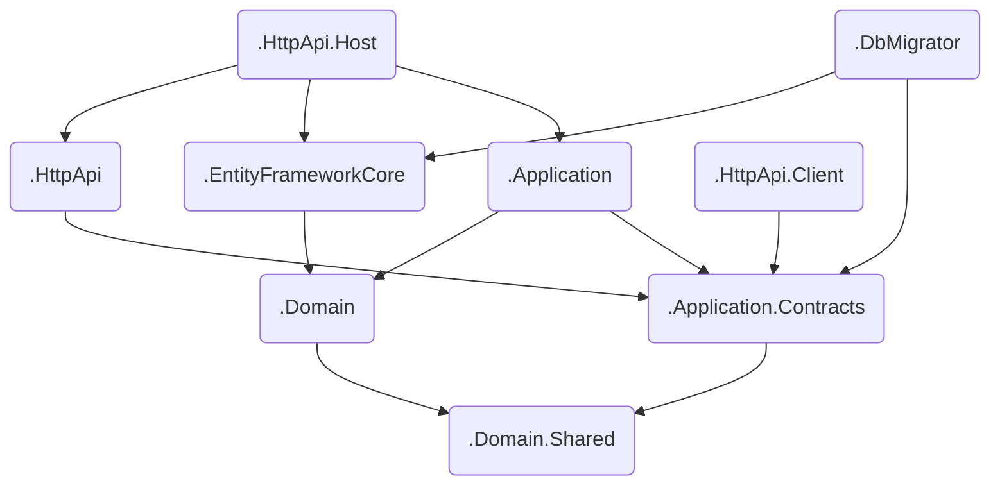

> 官网：https://docs.abp.io/
# 分层
> ABP框架遵循DDD原则和模式去实现分层应用程序模型,该模型由四个基本层组成
* [表示层](#PresentationLayer): 为用户提供接口. 使用应用层实现与用户交互.
* [应用层](#ApplicationLayer): 表示层与领域层的中介,编排业务对象执行特定的应用程序任务. 使用应用程序逻辑实现用例.
* [领域层](#DomainLayer): 包含业务对象以及业务规则. 是应用程序的核心.
* [基础设施层](#InfrastructureLayer): 提供通用的技术功能,支持更高的层,主要使用第三方类库.

<!--more-->

# ABP架构各层依赖关系

# ABP各层作用
## 
表示层</a>
### .HttpApi.Host
项目作为一个独立的端点提供 HTTP API 服务，供客户端调用。

该项目是一个承载解决方案 API 的应用程序。它有自己的 appsettings.json 文件(数据库连接字符串等其他配置)。
### .DbMigrator
> 必要时创建数据库（没有数据库时）、应用未迁移的数据库迁移、初始化种子数据（当你需要时）。

一个简单的控制台应用程序，它简化了在开发和生产环境执行数据库迁移的操作，当你执行它时，会迁移数据库结构并初始化种子数据。

## 
应用层</a>
### .Application.Contracts
> 它依赖 .Domain.Shared 因为它可能会在应用接口和DTO中使用常量，枚举和其他的共享对象。

项目主要包含 应用服务 interfaces 和应用层的 数据传输对象（DTO）。它用于分离应用层的接口和实现。这种方式可以将接口项目做为约定包共享给客户端。

例如 IBookAppService 接口和 BookCreationDto 类都适合放在这个项目中。
### .Application
应用层，用于定义 API 控制器，实现在 Contracts 项目中定义的接口。

大多数情况下，你不需要手动定义 API 控制器,因为 ABP 的动态 API 功能会根据你的应用层自动创建 API 控制器。但是如果你需要编写 API 控制器，那么它是最合适的地方。

## 
领域层</a>
### .Domain
> 它依赖 .Domain.Shared 项目，因为项目中会用到它的一些常量,枚举和定义其他对象。

解决方案的领域层。它主要包含：实体、集合根、领域服务、值类型、仓储接口和解决方案的其他领域对象。

例如 Book 实体和 IBookRepository 接口都适合放在这个项目中。

### .Domain.Shared
> 该项目不依赖解决方案中的其他项目，其他项目直接或间接依赖该项目。

领域共享层，包含属于领域层，但是与其他层共享的类型。项目包含常量，枚举和其他对象，这些对象实际上是领域层的一部分，但是解决方案中所有的层/项目中都会使用到。

例如 BookType 枚举和 BookConsts 类（可能是 Book 实体用到的常数字段，像 MaxNameLength ）都适合放在这个项目中。
## 
基础设施层</a>
### .EntityFrameworkCore
>它依赖 .Domain 项目，因为它需要引用实体和仓储接。

EF Core核心基础依赖项目，这是集成 EF Core 的项目。它定义了 DbContext 并实现 .Domain 项目中定义的仓储接口，包含：数据上下文、数据库映射、EF Core仓储实现等。